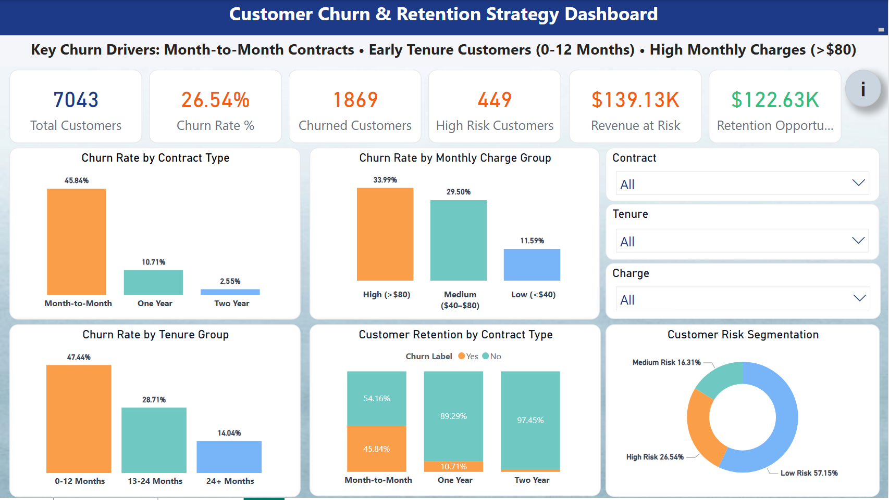

# Customer Churn Analysis & Retention Strategy

## Project Summary

This project analyzes telecom customer churn to identify high-risk customer segments and quantify revenue impact. Using **SQL for data analysis** and **Power BI for visualization**, the dashboard reveals key churn drivers and highlights **$139K revenue at risk and $122K potential retention opportunity**.

## Skills Demonstrated

* SQL (Data Cleaning, Aggregation, Churn Analysis)
* Power BI Dashboard Development
* DAX Calculations
* Customer Segmentation
* Business Insight Generation

## Overview

This project analyzes telecom customer data to identify key drivers of customer churn and uncover opportunities for targeted retention strategies.

Using **SQL for data analysis** and **Power BI for visualization**, the project highlights high-risk customer segments and quantifies the financial impact of churn.

---

## Tools Used

* SQL
* Power BI
* DAX

---

## Dashboard Preview

---

## Key Insights

* 45.8% churn observed among **Month-to-Month contracts**
* Customers within their **first 12 months** show the highest churn rates
* **High monthly charges (> $80)** correlate with higher churn risk

---

## Business Impact

* Identified **$139K revenue at risk**
* Highlighted **$122K retention opportunity**

---

## Business Recommendations

Based on the analysis, the following actions could reduce churn and protect revenue:

* **Encourage long-term contracts** by offering discounts for one-year or two-year plans.
* **Target early-tenure customers (0–12 months)** with onboarding and engagement campaigns.
* **Offer loyalty incentives for high-charge customers (> $80)** to reduce churn risk.
* **Monitor high-risk customer segments proactively** using churn prediction dashboards.

These actions could help retain high-value customers and reduce revenue loss from churn.

---

## Dataset

This project uses the **Telco Customer Churn dataset**, which contains telecom customer information such as:

* Contract type
* Monthly charges
* Tenure
* Payment methods
* Churn status

The dataset includes **7,043 customer records** used to analyze churn patterns.

---

## Project Files

* `churn_dashboard.pbix` – Power BI dashboard
* `churn_analysis_queries.sql` – SQL queries used for analysis
